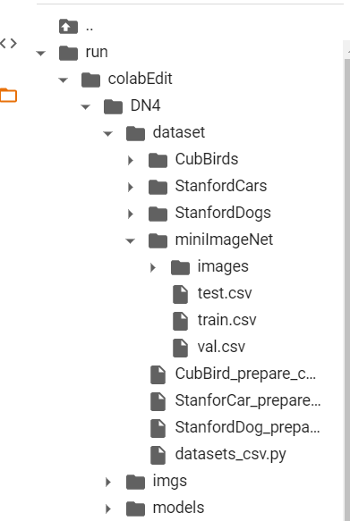

测试DN4的准备工作，在colab中执行

~~~shell
# 准备工作
! pwd
! mkdir /content/run
% cd /content/run

# 下载代码
! git clone https://github.com/Jf-Chen/colabEdit.git
% cd /content/run/colabEdit/DN4

# 下载mini-imagenet.zip

! gdown --id 1HkgrkAwukzEZA0TpO7010PkAOREb2Nuk
# 必须解压到data_dir/images下，而 data_dir/train.csv是csv所在位置
! unzip -uq "/content/run/colabEdit/DN4/mini-imagenet.zip" -d "./dataset/miniImageNet"
! pwd
~~~

train_csv = os.path.join(data_dir, 'train.csv')

query_dir = [path.join(data_dir, 'images', i) for i in query_imgs]

目录结构为

----

~~~python
# python代码

~~~

DN4.network中的model.forward(),一组[5,3,84,84]转为[5,64,21,21]，描述符是什么大小，有多少个

我认为有5x21x21个大小为64的描述符，将五张图片混合，就有21x21种5个一组的描述符，每种的大小都是64,这样就能说得通query_sam的【64.441】了——一张query有441个描述符，每个64大小。

计算cos,[441,64]@[64,2205],，左边的441种描述符，每个都与2205个比较大小，取相似度最高的三对

[4,1]@[1,20]->[4,20],第(i,j)的位置相当于query中第i种描述符与support中第j个描述符的相似度。我觉得这种计算不合理，不应该每种描述符之内类内比较吗。不过哟了topk指定了维度，只看维度1，每种描述符取一个最大值。但是这样依旧包含了不同类描述符之间的相似度。应该只看对角线。

从所有种类的描述符中选择最接近的一个恰恰是NBNN的思想。而不是需要对应描述符的种类（或许可以实验下对应种类最接近的）

N-way K-shot

5-way 1-shot 15-query,随机抽取5类，每类抽取（K+m）（1+15）个实例，组成support set(5x1)&query set(5x15)

5-way 5-shot 10-query,随机抽取5类，每类抽取（K+m）（5+10）个实例，组成support set(5x5)&query set(5x10)

