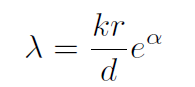
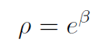

~~~python
FRN.forward_pretrain()

inp # [128, 3, 84, 84] 一个batch的图像

feature_map = self.get_feature_map(inp) #torch.Size([128, 25, 640]) # N,HW,C
# 每张图得到25个640维特征

feature_map = feature_map.view() #[3200, 640],该类别的所有图的特征都放在一个池子里

recon_dist = self.get_recon_dist(query,support,alpha,beta) # [3200, 64]
 	query: way*query_shot*resolution, d 
 	support: way, shot*resolution , d
 	query=feature_map,support=self.cat_mat,alpha=alpha,beta=beta
 	cat_mat在model初始化时定义，大小[64, 25, 640]，内容是随机生成的变量
 	self.cat_mat = nn.Parameter(torch.randn(self.num_cat,self.resolution,self.d),requires_grad=True) 
 	num_cat=64,是train_loader的类别数，
 	resolution在初始化时定义，self.resolution = 25，含义是H*W——特征提取后的图像是大小5*5*640
~~~

recon_dist，在batch_size=128时，[3200,64]，neg_l2_dist.size(): torch.Size([128, 64])

  

~~~python
FRN.get_recon_dist()

reg = support.size(1)/support.size(2) # 64/25
lam = reg*alpha.exp()+1e-6  # lambda
rho = beta.exp()

st = support.permute(0,2,1) # way, d, shot*resolution
~~~

